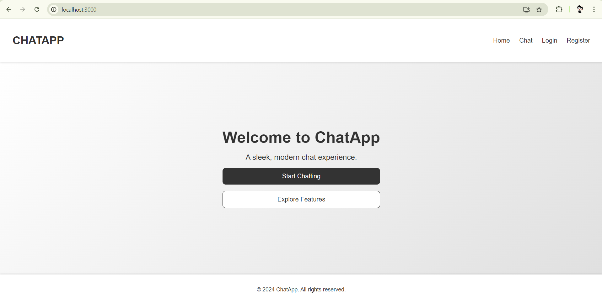
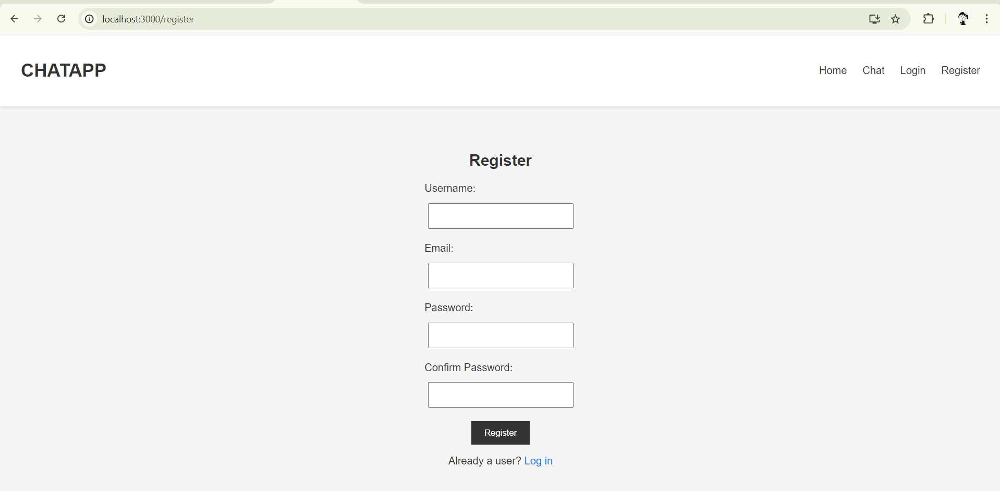
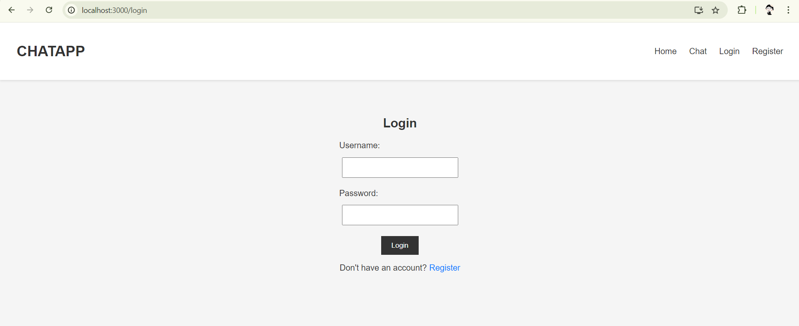
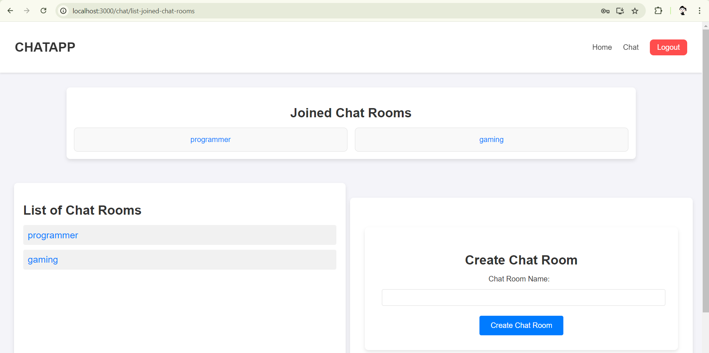
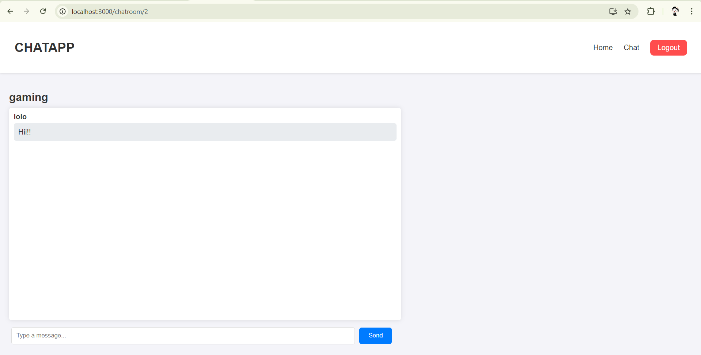

# Real-Time Chat Application

A simple and efficient chat application built using Django Channels and React.

## Features

- Real-time messaging
- User authentication
- Private and group chats

## Installation

### Backend

1. Clone the repository:
    ```sh
    git clone https://github.com/username/chat-application.git
    ```
2. Navigate to the project directory:
    ```sh
    cd chat-application
    ```
3. Navigate to the backend directory:
    ```sh
    cd backend
    ```
4. Install dependencies:
    ```sh
    pip install -r requirements.txt
    ```
5. Run database migrations:
    ```sh
    python manage.py migrate
    ```

### Frontend

1. Navigate to the frontend directory:
    ```sh
    cd ../frontend
    ```
2. Install frontend dependencies:
    ```sh
    npm install
    ```

## Usage

### Backend

1. Start the Redis service:
    ```sh
    redis-server start
    ```
2. Navigate to the backend directory (if not already there):
    ```sh
    cd backend
    ```
3. Run the Daphne server to start Django Channels:
    ```sh
    daphne -p 8000 backend.asgi:application
    ```
4. The backend will be available at `http://localhost:8000`.

### Frontend

1. Navigate to the frontend directory (if not already there):
    ```sh
    cd ../frontend
    ```
2. Start the React development server:
    ```sh
    npm start
    ```
3. The frontend will be available at `http://localhost:3000`.


## Screenshots

Here are some screenshots of the application:







